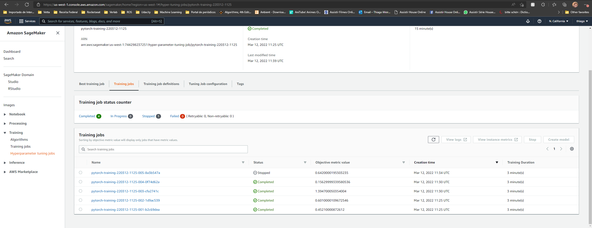
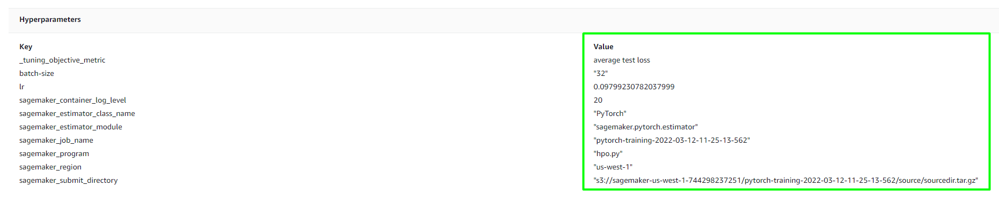
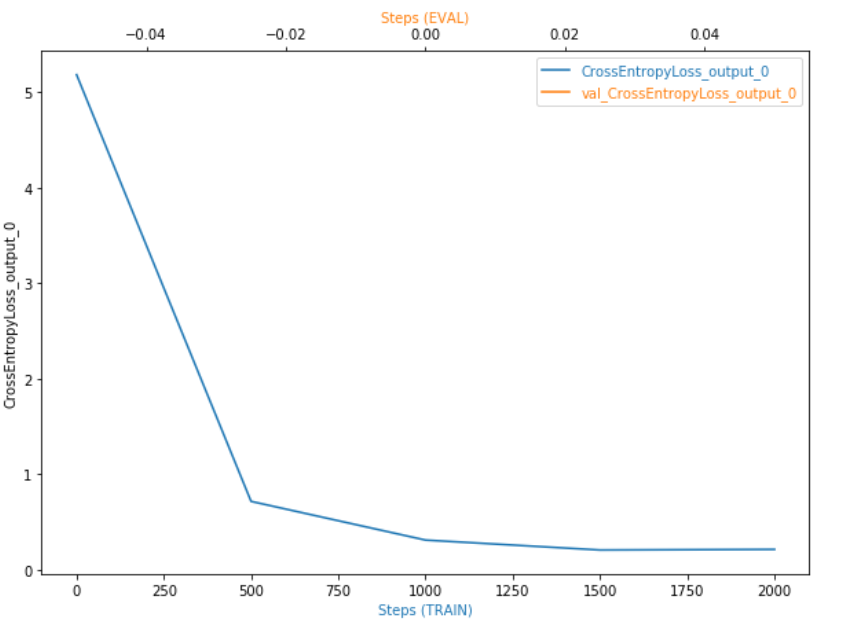
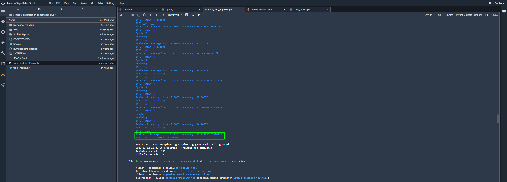
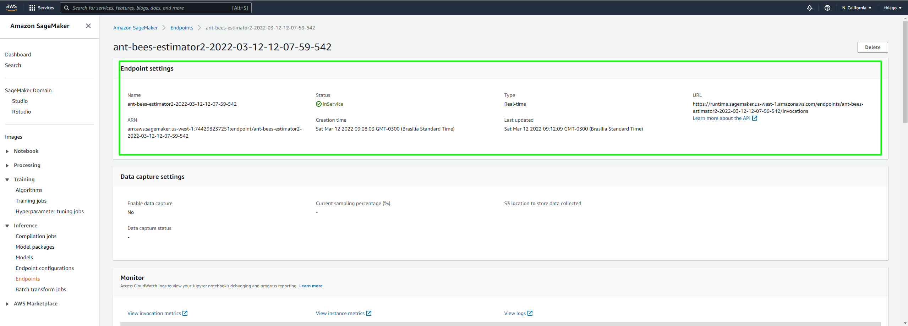
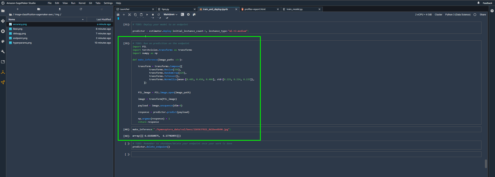

# Image Classification using AWS SageMaker

Use AWS Sagemaker to train a pretrained model that can perform image classification by using the Sagemaker profiling, debugger, hyperparameter tuning and other good ML engineering practices. This can be done on either the provided dog breed classication data set or one of your choice.

## Project Set Up and Installation
Enter AWS through the gateway in the course and open SageMaker Studio. 
Download the starter files.
Download/Make the dataset available. 

## Dataset
The provided dataset is the dogbreed classification dataset which can be found in the classroom.
The project is designed to be dataset independent so if there is a dataset that is more interesting or relevant to your work, you are welcome to use it to complete the project.

### Access
Upload the data to an S3 bucket through the AWS Gateway so that SageMaker has access to the data. 

## Hyperparameter Tuning
This project used the pretrained [Resnet18](https://pytorch.org/hub/pytorch_vision_resnet/) and a final fully connected layer to perform the final classification. Using the `best_estimator()` it is possible to achive the best hyperparameters configuration.

The best hyperparameters was:

## Debugging and Profiling

The Loss decreased smoothly indicating a good training. The Model itself performed well withou any issues and the metric was satisfying.

### Results

The model performed very well achieving 95.4% of accuracy

## Model Deployment
The model is deployed using the following endpoint:

I have developed a simple function to load the data using its path and performing the inference:

